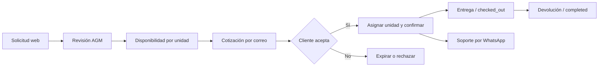
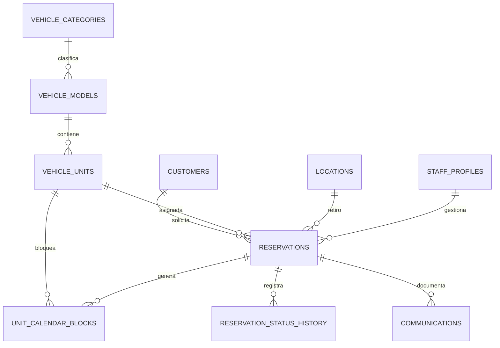

# Backend de reservas AGM

Esta estructura convierte la web estática en la base de un sistema de reservas
operado por AGM. El correo sigue siendo el canal formal para cotizaciones,
confirmaciones y documentación; WhatsApp se registra únicamente como soporte.

## Secuencia operativa

1. La web envía una solicitud a una Edge Function. El navegador no inserta
   directamente en las tablas privadas.
2. La función normaliza el correo, crea o reutiliza al cliente y registra la
   reserva como `requested`.
3. Un operador revisa fechas, categoría y lugar de entrega. La reserva pasa a
   `reviewing`.
4. AGM envía la propuesta formal por correo y registra la comunicación. El
   estado pasa a `quoted`.
5. Cuando el cliente acepta, el backend ejecuta `confirm_reservation` para
   asignar una unidad física y confirmar en una sola transacción.
6. El trigger crea el bloqueo del calendario. La restricción de exclusión de
   PostgreSQL rechaza cualquier cruce con otra reserva, mantención o bloqueo
   manual de esa unidad.
7. En la entrega se usa `checked_out`; después de la devolución, `completed`.
   Cancelaciones, rechazos y expiraciones liberan automáticamente el bloqueo.

## Estructura

- `vehicle_models`: lo que se publica en la web, por ejemplo Toyota RAV4.
- `vehicle_units`: cada vehículo físico, con código, patente, año, kilometraje
  y estado.
- `unit_calendar_blocks`: calendario único para reservas, mantenciones y
  bloqueos manuales.
- `reservations`: solicitud, cotización, asignación y estado operativo.
- `reservation_status_history`: historial auditable de cada cambio de estado.
- `communications`: correos, llamadas y soporte. La base impide usar WhatsApp
  con un propósito distinto de `support`.
- `staff_profiles`: autorización del panel interno mediante Supabase Auth.

## Estados de una reserva

| Estado | Uso |
|---|---|
| `requested` | Solicitud recibida desde la web o un canal manual |
| `reviewing` | AGM está revisando disponibilidad y condiciones |
| `quoted` | Cotización formal enviada por correo |
| `confirmed` | Cliente aceptó y existe una unidad asignada |
| `checked_out` | Vehículo entregado |
| `completed` | Vehículo devuelto y arriendo cerrado |
| `cancelled` | Reserva cancelada |
| `rejected` | AGM no puede aceptar la solicitud |
| `expired` | La cotización venció sin confirmación |

## Seguridad

- RLS está activado en todas las tablas del esquema público.
- Visitantes anónimos solo pueden leer ubicaciones, categorías y modelos
  activos.
- Clientes, reservas, unidades, calendario y comunicaciones requieren un
  usuario de personal activo.
- El formulario público debe entrar por una Edge Function protegida con límite
  de solicitudes y Turnstile; nunca debe recibir una `service_role` en el
  navegador.
- `confirm_reservation` solo puede ejecutarse con `service_role` desde backend.

## Archivos

- `supabase/config.toml`: configuración local en los puertos estándar de
  Supabase; la URL de la web es `http://localhost:4173`.
- `supabase/migrations/*_initial_rental_operations.sql`: estructura, índices,
  restricciones, automatizaciones y políticas.
- `supabase/seed.sql`: ubicaciones, categorías y los cuatro modelos publicados.
  No incluye unidades físicas inventadas.

## Datos que debe entregar AGM

Antes de habilitar reservas reales se necesitan por cada unidad:

- código interno;
- patente;
- modelo y año;
- color;
- kilometraje inicial;
- estado operativo;
- períodos de mantención ya programados.

También se debe definir la vigencia de una cotización, horarios de entrega,
anticipación mínima y reglas de precios por temporada.

## Próxima etapa

Completado:

1. Proyecto remoto vinculado y migraciones aplicadas.
2. Datos iniciales cargados y asesores de Supabase sin incidencias.
3. Edge Function `request-quote` desplegada con validación, CORS, límite por
   correo y registro interno de la solicitud.
4. Cotizador de `code.html` conectado a la función y preparado para personas y
   empresas.

Pendiente:

1. Activar Turnstile antes de publicar el formulario en producción.
2. Configurar el proveedor de correo transaccional y verificar el dominio
   `agmrentacar.cl`.
3. Crear pruebas de solapamiento de calendario con unidades físicas reales.
4. Construir el panel interno de agenda, unidades y reservas.

Referencias oficiales:

- https://supabase.com/docs/guides/database/postgres/row-level-security
- https://supabase.com/docs/guides/functions
- https://supabase.com/docs/guides/database/extensions
